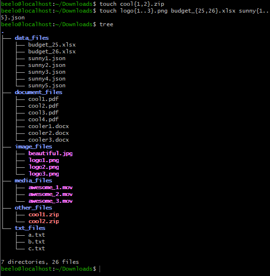
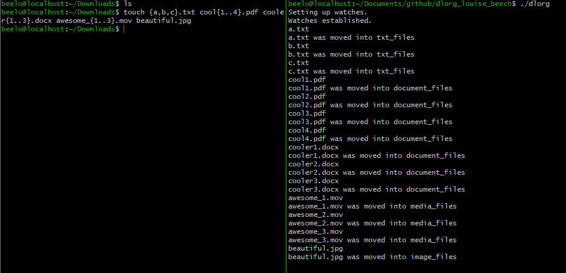
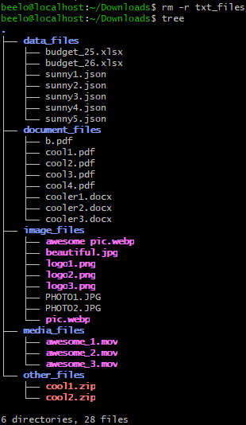
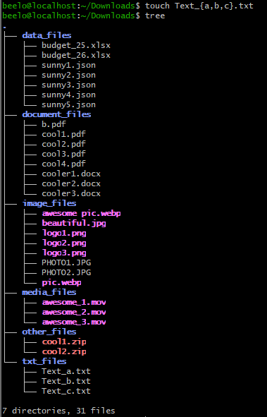
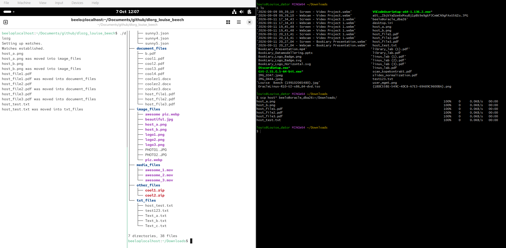

# dlorg

a bash script for organising the Downloads folder

## what it does

dlorg will watch your Downloads folder using `inotifywait` and sort new, renamed and moved-in files into subfolders depending on the filename extension. Unknown file types will end up in *other_files*. If a subfolder is deleted or doesn't exist, the script will create the folder. 

## what you need

- Linux system - script written in bash
- inotify-tools - package provides `inotifywait`
- git - to clone the repo

install inotify package:
(for an Oracle Linux 10)

```bash
sudo dnf install oracle-epel-release-el10
sudo dnf install inotify-tools
```

## how to setup

1. clone the repo in `~/Documents/github` to match the path used in the unit file's `ExecStart` or edit it later to match*   

```bash
mkdir -p ~/Documents/github && cd ~/Documents/github
git clone https://github.com/louisebeech91/dlorg_louise_beech.git
cd dlorg_louise_beech
```

2. to test the script 
run it:

```bash
./dlorg
```
then create a file from a second terminal:

```bash
touch ~/Downloads/test.pdf
ls -R ~/Downloads
```

the file should have moved into a subfolder. Stop the script with `Ctrl+C`

3. (optional) run it as a background service that starts when you log in:
*if you didn't clone the repo in the `~/Documents/github`, now is the time to change `ExecStart` path in the unit file `dlorg.service`

```bash
mkdir -p ~/.config/systemd/user
cp systemd/dlorg.service ~/.config/systemd/user/
sudo systemctl daemon-reload
systemctl --user enable dlorg.service
systemctl --user start dlorg
```

check that it is running:

```bash
systemctl status dlorg
```

## examples 

when files are created they get sorted into subfolder by extension


creating files and watching them get sorted


moving a file into Downloads and watching them get sorted


subfolder is removed and recreated when a new file with that extension is created



files moved from host to VM using scp


 
